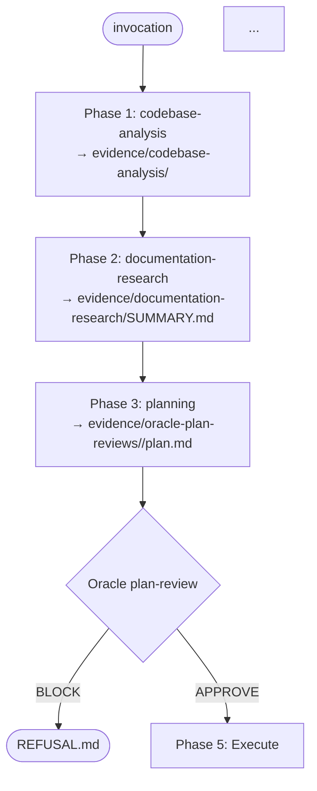

# /crucible:explain

Show the call graph of any Crucible command or skill. No execution, no
mutation — just the structure.

## Usage

```
/crucible:explain                       # show the master pipeline (forge)
/crucible:explain <command>             # show one command's pipeline
/crucible:explain --skills              # list all skills + their evidence outputs
/crucible:explain --agents              # list all subagents + their roles
/crucible:explain --hooks               # list all hooks + their event/matcher
```

## Pipeline

### Step 1 — Resolve the target
- Bare `/crucible:explain` → target = `forge`
- `/crucible:explain <name>` → target = `commands/<name>.md`
- Flag forms produce inventory tables (no DAG)

### Step 2 — Build the DAG

For a command target, parse the file and extract:
- The "Pipeline" section's numbered steps
- Each step's invoked skill, agent, or hook
- Each step's required evidence output path

Render a Mermaid `flowchart TD` with one node per step, edges in pipeline order,
and side annotations citing evidence paths.

### Step 3 — Print

Output format:

```
CRUCIBLE EXPLAIN — /crucible:<target>
=====================================

Description:
  <pulled from frontmatter>

Required activation:
  <pulled from "Required activation" section, or "none" for diagnostics>

Pipeline DAG:



Refusal modes:
  Phase 1 — codebase-analysis SUMMARY.md missing
  Phase 4 — oracle BLOCK
  ...

Subagent dispatch:
  reviewer-a, reviewer-b, reviewer-c (Phase 8, parallel)
  oracle-1, oracle-2, oracle-3 (Phase 9, parallel)

Hooks involved:
  PostToolUse → bin/post-task.sh (seals every step)
  Stop → bin/completion-attempt.sh (gates session end)
```

### Step 4 — Inventory mode (`--skills` / `--agents` / `--hooks`)

For `--skills`: walk `skills/*/SKILL.md`, extract frontmatter `name` +
`description`, print as a table.

For `--agents`: walk `agents/*.md`, extract `name`, `description`, and
infer role from the file body. Print as a table.

For `--hooks`: parse `hooks/hooks.json`, print event + matcher + script per
registered hook.

## Output (typical, for forge)

The DAG output mirrors Diagram A from the architecture proposal but rendered
on demand from the actual files (so it never goes stale).

## What this does NOT do

- Does NOT execute any phase
- Does NOT modify any file
- Does NOT spawn any subagent
- Does NOT verify the DAG matches reality (use `/crucible:doctor` for that)

## Why it matters

Crucible's value is the discipline encoded in its DAG. A user who can't see
the DAG can't reason about why a refusal happened. `/crucible:explain` makes
the discipline visible.
