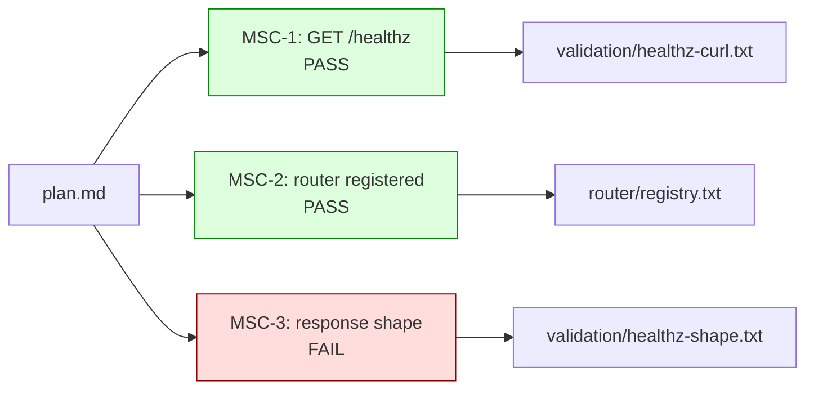

# /crucible:graph

Visualize the evidence tree as a graph. Each node is an MSC or evidence
artifact; each edge is a dependency. Color/icon encodes status. Useful for
"where did forge stall?" debugging.

## Usage

```
/crucible:graph                      # latest run
/crucible:graph --run-id <iso>       # specific run
/crucible:graph --all                # all runs (warning: large)
```

## Pipeline

### Step 1 — Resolve target run(s)

- Bare invocation: most recent run-id (max mtime across `evidence/oracle-plan-reviews/`,
  `evidence/validation-artifacts/`, `evidence/robust-trials/`)
- `--run-id <iso>`: that exact run-id
- `--all`: every run found

### Step 2 — Read the gate report

If `evidence/completion-gate/report.json` exists for the target run, parse it.
Each MSC in the report has a status (`PASS`, `FAIL`, `INSUFFICIENT`) and a
`citations` array.

If no gate report exists, infer status from artifact presence (per the same
phase-probe table as `/crucible:resume`).

### Step 3 — Build the graph

Render a Mermaid `flowchart LR` with:
- One node per MSC (MSC-1, MSC-2, ...)
- Edge from each MSC to its cited evidence file(s)
- Color: green (PASS), red (FAIL), yellow (INSUFFICIENT), gray (not yet evaluated)

Aggregate nodes:
- One node per phase artifact (codebase-analysis, plan, validation, etc.)
- Edge from phase artifact to MSCs that cite it

### Step 4 — Print

```
CRUCIBLE GRAPH — run <iso>
==========================

Status:    <COMPLETE|REFUSED|IN-PROGRESS>
MSCs:      <P>/<F>/<I>/<G> (PASS / FAIL / INSUFFICIENT / pending)



Failed MSCs:
  MSC-3 — response.body.status was "ok" expected "ok" (case-insensitive failed)
         evidence/validation-artifacts/<run>.md:42

Pending MSCs:
  (none)
```

## Output mode

Default: print Mermaid + summary inline. Useful in any chat client that
renders Mermaid.

The Mermaid block is also valid input for the `mcp__claude_ai_Mermaid_Chart`
renderer if a richer view is wanted.

## Refusal modes

- No runs found → refuse with hint to run `/crucible:forge` first
- Run-id specified doesn't exist → refuse, list available run-ids
- `report.json` malformed → refuse parsing; print raw JSON for the user

## What graph does NOT do

- Does NOT modify evidence
- Does NOT re-run validation to refresh status
- Does NOT consume the SDK or any subagent

Graph is a viewer. Treat it as `cat` with structure.
