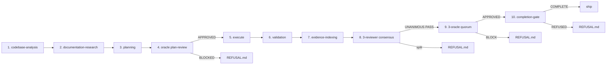

# Crucible — In-Depth Overview

> *What survives the test, ships.*

This document is the conceptual reference for Crucible. If you want to know
*how to use it*, read [`USAGE.md`](./USAGE.md). If you want to know *why it
works the way it does*, you're in the right place.

---

## Table of contents

1. [What Crucible is](#1-what-crucible-is)
2. [Why it exists](#2-why-it-exists)
3. [The four iron rules](#3-the-four-iron-rules)
4. [Component architecture](#4-component-architecture)
5. [The forge pipeline](#5-the-forge-pipeline)
6. [Evidence model](#6-evidence-model)
7. [Quorum mechanics](#7-quorum-mechanics)
8. [Gate sequence (VG-0..VG-15)](#8-gate-sequence-vg-0vg-15)
9. [Refusal protocol](#9-refusal-protocol)
10. [Retry semantics & autopilot](#10-retry-semantics--autopilot)
11. [Activation lifecycle](#11-activation-lifecycle)
12. [Hooks & enforcement layer](#12-hooks--enforcement-layer)
13. [Comparison to alternatives](#13-comparison-to-alternatives)
14. [Glossary](#14-glossary)

---

## 1. What Crucible is

Crucible is a Claude Code plugin that converts task execution into a scientific
procedure. Every change-producing run — planning, validation-only, or
SDK-driven — produces a reproducible **evidence package**, and completion is
forbidden unless every Mandatory Success Criterion is backed by an inspectable
artifact and a quorum of independent Oracles approves.

In one sentence: **Crucible is the gate between "I did the work" and "the work
is done."**

It ships:

| | Count | What |
|---|---|---|
| Slash commands | 19 | Three tiers: orchestrators, authoring, inspection |
| Skills | 11 | Composable capability units |
| Subagents | 10 | Independent reviewers, planners, oracles, validators |
| Hooks | 4 | SessionStart · PreToolUse · PostToolUse · Stop |
| Bin scripts | 4 | Hook handlers (read JSON stdin, exit 2 to block) |
| Setup scripts | 2 | CLAUDE.md installer + progress tracker |
| Rule templates | 4 | Iron-Rule, Cite-or-Refuse, Cite-Paths, No-Self-Review |

---

## 2. Why it exists

LLM-driven engineering systems routinely declare success without proof. They:

- claim a feature works because the code looks right;
- claim a refactor preserves behavior because it compiles;
- claim a bug is fixed because the agent says so;
- claim a verification passed by *summarizing* output that nobody read;
- emit "Done!" while leaving silent test failures, missing migrations, or stale
  references behind.

This is not adversarial. It's the default failure mode of a context-window-bounded
system that is trained to produce coherent text. Coherent text is not evidence.

Crucible removes the option to fake completion. It does this by making three
moves at the plugin layer:

1. **Hooks watch every tool use.** A `PreToolUse` rejects writes to test files,
   mock fixtures, stub modules. A `Stop` hook refuses session termination
   unless `evidence/completion-gate/report.json` exists and shows
   `overall=COMPLETE`.

2. **Verdicts cite paths or are invalid.** Every PASS / FAIL / APPROVE / BLOCK
   the system emits must point to a specific file (and ideally line range).
   Prose descriptions are not citations.

3. **Independence is structural, not advisory.** The agent that produced an
   artifact may not also approve it. Three reviewers run in isolation. Three
   Oracles run in isolation. The synthesizer aggregates raw verdicts; it
   never rewrites or "balances" them.

The result: when Crucible says a task is COMPLETE, an outside reviewer with
only the `evidence/` tree can independently verify that claim. When it
refuses, the refusal is structured, machine-readable, and remediable.

---

## 3. The four iron rules

Crucible's discipline reduces to four rules. They are installed into your
project's `CLAUDE.md` by `/crucible:setup` and live as canonical templates in
`templates/rules/`.

### RL-1 — No mocks (Iron Rule)

Validation runs against real systems only.

**Forbidden:** mocks, stubs, fakes, test doubles, fixtures, test files
(`*.test.*`, `*.spec.*`, `tests/`, `__tests__/`), test frameworks, SDK
substitutions, hand-written "expected" output presented as actual output,
mkdir-simulated installations.

**Allowed:** real CLI invocations with stdout/stderr captured verbatim, real
HTTP requests with response headers + body, real filesystem inspection of
installed artifacts, real session JSONL files written by Claude Code or the
SDK.

The `PreToolUse` hook enforces RL-1 mechanically: it rejects any Write or Edit
whose path matches a test/mock pattern. This means an agent *cannot* satisfy
a missing-test gap by writing a fake test — the hook returns exit 2 and
Claude sees the rejection.

### RL-2 — Cite or Refuse

Every PASS / FAIL / APPROVE / BLOCK verdict MUST cite a specific evidence file
path. A PASS verdict that lacks a citation is INVALID.

This is what makes Crucible's evidence package independently auditable. A
reviewer who has never seen the agent's reasoning can read `report.json`,
follow each citation, and reproduce the verdict.

### RL-3 — No Self-Review

The agent that PRODUCED an artifact may NOT also REVIEW or APPROVE it.

- Planner may not review its own plan → Oracle plan-review convenes separately.
- Validator may not approve its own verdict → reviewer consensus required.
- Reviewers/Oracles cannot write each other's verdicts.
- The synthesizer (parent session) only aggregates; never reviews.

This is implemented via subagent isolation. When the parent session dispatches
`reviewer-a`, `reviewer-b`, `reviewer-c` via `Task`, each runs in its own
context window. They cannot see each other's output until the parent
synthesizes.

### RL-4 — Cite Paths (specificity)

Citations must be maximally specific:

| Specificity | Example | Status |
|---|---|---|
| File + line range | `evidence/session-logs/<id>/session.jsonl:42-58` | ✅ ideal |
| File | `evidence/oracle-plan-reviews/<id>/plan.md` | ✅ acceptable |
| Directory | `evidence/session-logs/<id>/` | ⚠️ only when the *whole dir* IS the artifact |
| Subtree | `evidence/` or `evidence/session-logs/` | ❌ too broad |

`/crucible:completion-gate` walks the evidence tree and parses citations; it
will refuse a verdict whose citation does not resolve to a real, non-empty
file or directory.

---

## 4. Component architecture

Crucible is a layered system. Each layer has a specific responsibility and a
specific failure mode if violated.

```
┌─────────────────────────────────────────────────────────────────────┐
│  Tier 1: Orchestrators       (19 commands, 3 tiers — see below)     │
│  forge · autopilot · remediate · resume · trial                     │
└─────────────────────────────────────────────────────────────────────┘
                              │
                              ▼
┌─────────────────────────────────────────────────────────────────────┐
│  Skills (11)                                                        │
│  codebase-analysis · documentation-research · planning · validation │
│  evidence-indexing · session-log-audit · oracle-review              │
│  completion-gate · enable · disable · setup                         │
└─────────────────────────────────────────────────────────────────────┘
                              │
                              ▼
┌─────────────────────────────────────────────────────────────────────┐
│  Subagents (10) — dispatched via Task, one task each                │
│  planner · codebase-analyst · documentation-researcher · validator  │
│  reviewer-a · reviewer-b · reviewer-c                               │
│  oracle-auditor-1 · oracle-auditor-2 · oracle-auditor-3             │
└─────────────────────────────────────────────────────────────────────┘
                              │
                              ▼
┌─────────────────────────────────────────────────────────────────────┐
│  Hooks (4) — bash scripts, read JSON from stdin, exit 2 to block    │
│  SessionStart · PreToolUse · PostToolUse · Stop                     │
└─────────────────────────────────────────────────────────────────────┘
                              │
                              ▼
┌─────────────────────────────────────────────────────────────────────┐
│  Evidence/                                                          │
│  ~/your-project/evidence/{16 standard subdirs}/{run-id}/...        │
│  Append-only. Every artifact has README.md + INDEX.md.              │
└─────────────────────────────────────────────────────────────────────┘
```

### Tier 1 — Orchestrators (the conductors)

| Command | What it does |
|---|---|
| `/crucible:forge <task>` | The full pipeline. **Start here for most work.** |
| `/crucible:autopilot <task>` | `forge` in a refusal-driven retry loop |
| `/crucible:remediate` | Read `REFUSAL.md`, produce a delta plan, execute |
| `/crucible:resume` | Continue a halted forge (evidence tree IS the state) |
| `/crucible:trial <name> <task>` | Forge inside `evidence/robust-trials/trial-NN/` |

### Tier 2 — Authoring

| Command | What it does |
|---|---|
| `/crucible:setup` | Install / refresh CLAUDE.md rule block (run once per project) |
| `/crucible:stack-new` | Bootstrap a project (evidence/ + activation + setup) |
| `/crucible:skill-new <name>` | Scaffold `skills/<name>/SKILL.md` |
| `/crucible:agent-new <name> --role <role>` | Scaffold `agents/<name>.md` |
| `/crucible:rule-new <name>` | Scaffold a CLAUDE.md rule fragment |
| `/crucible:hook-new <name> --event <event>` | Scaffold `bin/<name>.sh` + register |
| `/crucible:command-new <name>` | Scaffold a top-level slash command |

### Tier 3 — Inspection (read-only)

| Command | What it does |
|---|---|
| `/crucible:doctor` | 9-check installation + activation health |
| `/crucible:status` | Pretty-print completion-gate state |
| `/crucible:explain [<command>]` | DAG of any pipeline |
| `/crucible:fix` | Idempotent auto-repair (creates only; never deletes) |
| `/crucible:graph [--run-id <iso>]` | Mermaid graph of evidence-tree state |

### Tier 0 — Activation primitives

`/crucible:enable` · `/crucible:disable` · `/crucible:planning` · `/crucible:validation` · `/crucible:codebase-analysis` · `/crucible:documentation-research` · `/crucible:evidence-indexing` · `/crucible:session-log-audit` · `/crucible:oracle-review` · `/crucible:completion-gate` · `/crucible:plan-and-execute` · `/crucible:validate` · `/crucible:audit`

Tier-1 conductors compose these. Use them directly when you need fine-grained
control or when debugging a specific phase.

---

## 5. The forge pipeline

`/crucible:forge` runs ten phases. Each phase produces a specific artifact in
`evidence/`. Each phase has a refusal trigger that halts the pipeline if
preconditions are not met.



| # | Phase | Skill | Refusal trigger |
|---|---|---|---|
| 1 | codebase-analysis | `crucible:codebase-analysis` | repo not analyzable |
| 2 | docs-research | `crucible:documentation-research` | missing upstream sources |
| 3 | planning | `crucible:planning` (planner subagent) | MSCs unspecified or unmeasurable |
| 4 | oracle plan-review | `crucible:oracle-review` (3 oracles) | ≥1 BLOCK with cited blockers |
| 5 | execute | (host session) | hook rejects test/mock writes |
| 6 | validation | `crucible:validation` (validator subagent) | Iron Rule violation |
| 7 | evidence-indexing | `crucible:evidence-indexing` | dirs left un-indexed |
| 8 | 3-reviewer consensus | `crucible:reviewer-consensus` (3 reviewers) | not unanimous PASS |
| 9 | 3-oracle quorum | `crucible:oracle-review` (3 oracles) | <2/3 APPROVE |
| 10 | completion-gate | `crucible:completion-gate` | any MSC missing or BLOCKED |

Phases 1-4 are pre-execution. Phases 5-7 are execution + immediate validation.
Phases 8-10 are post-execution audit. **The pipeline halts at the first
refusal.** No "best effort" advancement.

---

## 6. Evidence model

The `evidence/` tree is Crucible's only state. It is append-only, deterministic
(ISO-8601 IDs), and structured so every directory has a `README.md` (purpose)
and an `INDEX.md` (artifact enumeration).

### Standard layout

```
your-project/
├── .crucible/
│   ├── active                  # activation sentinel (presence = enabled)
│   └── disabled                # kill switch (overrides active)
└── evidence/
    ├── INDEX.md                # top-level index of all sub-trees
    ├── README.md               # what this whole package is
    ├── session-receipts/       # one file per tool use, written by hooks
    ├── session-logs/           # captured Claude Code JSONL session logs
    ├── codebase-analysis/      # phase 1 output
    ├── documentation-research/ # phase 2 output (raw upstream sources)
    ├── prd/                    # PRD, MSCs, version stamp
    ├── architecture/           # ARCHITECTURE.md + diagrams
    ├── oracle-plan-reviews/    # phase 4: per-run plan + 3 oracle verdicts
    ├── robust-trials/          # phase 5: trial-NN/ subdirs
    │   └── trial-NN/
    │       ├── plan.md
    │       ├── execution-log.txt
    │       ├── INVOCATION.txt
    │       └── ...
    ├── validation-artifacts/   # phase 6: per-MSC PASS/FAIL with citations
    ├── reviewer-consensus/     # phase 8: 3 isolated reports + decision.md
    ├── final-oracle-evidence-audit/  # phase 9: 3 oracles + decision.md
    ├── completion-gate/        # phase 10: report.json (COMPLETE | REFUSED)
    │   ├── report.json
    │   └── REFUSAL.md          # only present when overall=REFUSED
    └── performance/            # hook-overhead measurements
```

### Mandatory Success Criteria (MSCs)

Crucible's identity is enforced through MSCs — atomic, testable, citation-bound
acceptance criteria. The reference build of Crucible itself defined 21
(MSC-1..MSC-21) covering its own delivery: documentation citations, install
receipts, robust trials, session-log audits, reviewer consensus, oracle quorum,
and completion-gate refusal.

In your projects, MSCs come from the planner subagent during phase 3. Each MSC
must:

1. Be **atomic** — single observable outcome.
2. Be **measurable** — names a specific file/output that proves it.
3. Be **citable** — names where the proof will live (`evidence/.../path`).
4. Have an explicit **PASS criterion** — what does the file have to contain?

Example:

> **MSC-7:** Endpoint `GET /healthz` returns HTTP 200 with body
> `{"status":"ok"}`.
> **Citation path:** `evidence/validation-artifacts/<run-id>/step-03-curl-healthz.txt`
> **PASS criterion:** stdout matches `^HTTP/1.1 200` AND `^{"status":"ok"}$`.

A plan whose MSCs do not meet all four properties is rejected at oracle
plan-review (phase 4).

### Why append-only

Reproducibility. Every artifact has a fixed timestamp; nothing is overwritten.
A reviewer six months later can re-run `/crucible:completion-gate` against the
preserved tree and get the same verdict. Edits to historical evidence are
treated as tampering — `reviewer-c` (Iron-Rule reviewer) refuses on any
artifact whose timestamps don't match its declared creation time.

---

## 7. Quorum mechanics

Crucible enforces independence in two places: **3-reviewer consensus** (phase 8)
and **3-oracle quorum** (phase 9). They differ in emphasis but share the
isolation guarantee.

### 3-reviewer consensus (VG-13)

| Reviewer | Emphasis |
|---|---|
| `reviewer-a` | Completeness — does evidence exist at every cited path, non-empty? |
| `reviewer-b` | Integrity — does each file's content match its claim? |
| `reviewer-c` | Iron-Rule compliance — any mocks, fakes, fixtures, or test files? |

Each is dispatched in an isolated subagent context with read-only access to
`evidence/`. None can see another's verdict until the parent synthesizes.

**Decision rule:** UNANIMOUS PASS or REFUSED. There is no "majority" path —
because the three reviewers cover orthogonal dimensions, a 2/3 vote is a real
gap, not a swing voter.

The decision is written to `evidence/reviewer-consensus/decision.md` containing
the literal string `UNANIMOUS PASS` (the gate looks for this exact substring).

### 3-oracle quorum (VG-14)

| Oracle | Emphasis |
|---|---|
| `oracle-auditor-1` | Completeness-and-citation — do all MSCs have approved verdicts and citations? |
| `oracle-auditor-2` | Structural integrity — every dir has README.md + INDEX.md? Schema parses? |
| `oracle-auditor-3` | Adversarial skepticism — what would a hostile reviewer cite to BLOCK? |

Same isolation guarantee. Same path-citation discipline.

**Decision rule:** ≥2 of 3 APPROVE AND zero unresolved critical blockers. A
single Oracle's BLOCK with a cited critical blocker overrides two APPROVEs —
because the cited blocker is a real defect.

The decision is written to `evidence/final-oracle-evidence-audit/decision.md`
containing `APPROVED` or `BLOCKED` plus a blockers list.

### Why two layers

The reviewers are oriented at the *evidence package* — does what's there hold
up? The oracles are oriented at the *project* — does what's there cover the
contract? An incomplete project can have rigorous evidence (reviewers PASS,
oracles BLOCK). A complete project can have sloppy evidence (oracles APPROVE,
reviewers REFUSE). Both must agree before completion.

---

## 8. Gate sequence (VG-0..VG-15)

Crucible's reference build defines 16 verification gates. Most do not run on
your tasks — they were the gates Crucible itself had to pass to ship. They're
documented here because (a) the receipts live in this repo's `evidence/` and
(b) the same pattern applies if you build a system *on top of* Crucible.

| Gate | Phase | What it verifies |
|---|---|---|
| VG-0 | bootstrap | repo present, manifest parses |
| VG-1 | docs-research | upstream sources cited with timestamps |
| VG-2 | tbox-installation | install receipts via dual paths |
| VG-3 | plugin-records | parsed init-message enumeration |
| VG-4 | agent-sdk | SDK harness invocation traces |
| VG-5..8 | robust-trials | trial-01..04 (planning + validation + SDK) |
| VG-9 | session-logs | raw JSONL captured + line-cited |
| VG-10 | validation-artifacts | per-trial real-system outputs |
| VG-11 | session-log-audit | hook firings cited by line number |
| VG-12 | evidence-indexing | every dir has README.md + INDEX.md |
| VG-13 | reviewer-consensus | 3 reviewers UNANIMOUS PASS |
| VG-14 | final-oracle-audit | 3 oracles ≥2 APPROVE, 0 unresolved blockers |
| VG-15 | completion-gate | report.json overall=COMPLETE |
| VG-16 | (post-ship) | `/crucible:doctor` passes 9 checks |
| VG-17 | (post-ship) | self-validation: gate run again on this evidence |

Your project's MSCs (e.g. MSC-1..MSC-7 for a feature) are evaluated at the
project's own VG-15.

---

## 9. Refusal protocol

When any phase's exit criterion is unmet, Crucible writes a structured
`REFUSAL.md` and stops. **There is no override flag. There is no
force-complete.**

### REFUSAL.md schema

```markdown
# Crucible Refusal — <run-id>

**Phase:** <name of failing phase>
**Triggered by:** <agent or hook that wrote this>
**Timestamp:** <ISO-8601>

## Failing criteria

| ID | Status | Citation | Reason |
|----|--------|----------|--------|
| MSC-7 | FAIL | evidence/validation-artifacts/<id>/step-03.txt | expected 200, got 404 |
| MSC-12 | MISSING | (no file at expected path) | docs-research SUMMARY.md not produced |

## Cited blockers (from oracles)

- oracle-3: "trial-NN/INVOCATION.txt does not name the cache path it dispatched"

## Recommended remediation

<delta plan that targets only the failing criteria>

## How to retry

  /crucible:remediate
  /crucible:forge   # only after remediate produces a passing delta
```

### What a refusal *isn't*

- It isn't a bug report. The system is functioning correctly when it refuses.
- It isn't a soft warning. The Stop hook returns exit 2 and the session
  cannot end.
- It isn't recoverable by argumentation. You cannot talk Crucible into
  passing. You can only fix the cited gap and re-run.

### What a refusal *is*

- A structured, machine-readable diff between the system's contract and its
  reality.
- A specific, citation-bound list of what to fix.
- The fastest path to "actually done" — because the gaps are named.

The refusal stderr emitted by the Stop hook reproduces the cited gaps and
includes all four escape hatches (`/crucible:disable`, `touch
.crucible/disabled`, `CRUCIBLE_DISABLE=1`, `rm .crucible/active`) so you are
never stuck.

---

## 10. Retry semantics & autopilot

`/crucible:remediate` reads the latest `REFUSAL.md`, asks the planner
subagent for a delta plan covering *only* the failing MSCs (not the whole
task — that would be wasted work), and executes the delta. Then a fresh
`/crucible:forge` runs on the updated evidence tree.

`/crucible:autopilot <task>` is `forge` in a refusal-driven retry loop:

```
attempt = 1
forge(task)
while gate == REFUSED and attempt < max_attempts:
    remediate()
    forge(task)
    attempt += 1
emit final verdict
```

Default `--max-attempts=3`. If the loop exits with REFUSED, the final
`REFUSAL.md` lists which MSCs survived all attempts — those are real defects
in your task definition, not transient agent failures.

**Iron Rule preservation across retries:** every iteration runs through the
same hooks. A retry cannot bypass `PreToolUse` rejection. A retry that tries
to write a mock test gets the same exit-2 rejection the first attempt did.

---

## 11. Activation lifecycle

**Crucible is opt-in per project.** This is a deliberate choice introduced in
v0.1.1 — a user-scope install does NOT enforce in every project, because that
broke unrelated workflows in the wild.

### State diagram

```
┌──────────┐  /crucible:enable    ┌────────────────┐
│ INACTIVE │ ───────────────────▶ │   ACTIVE       │
│          │                       │ .crucible/    │
│          │ ◀─────────────────── │   active       │
└──────────┘  /crucible:disable    └────────────────┘
                                        │
                                        │ touch .crucible/disabled
                                        ▼
                                  ┌────────────────┐
                                  │  KILL-SWITCH   │
                                  │  (silent ops)  │
                                  └────────────────┘
```

### Three layers of safety

1. **Activation sentinel** — `.crucible/active` (presence = enabled).
2. **Kill switches** — `.crucible/disabled` file OR `CRUCIBLE_DISABLE=1` env.
3. **Fail-open on contradictory state** — if `.crucible/active` exists but no
   `evidence/completion-gate/` directory was ever created (typical of an
   abandoned mid-workflow session), the Stop hook prints a one-line warning
   and exits 0 instead of trapping the user.

### What `/crucible:setup` actually does

`/crucible:setup` is the canonical entrypoint for a new project. It:

1. Installs the canonical CLAUDE.md fragment (composed from `templates/rules/`)
   into your `./CLAUDE.md` (with `--local`) or `~/.claude/CLAUDE.md` (with
   `--global`), wrapped in `<!-- CRUCIBLE:START -->...<!-- CRUCIBLE:END -->`
   markers. Idempotent — re-running replaces only the marked block.
2. Creates `~/.claude/.crucible-config.json` with `{setupCompleted: true,
   setupVersion: "<plugin-version>", target: "local|global", timestamp: ...}`.
3. Activates the project (`mkdir -p .crucible && touch .crucible/active`).
4. Prints next-step guidance.

`/crucible:setup --force` overwrites the marker block (used after a
`/crucible:rule-new` or after rule template updates). `/crucible:setup
--uninstall` removes the marker block cleanly.

---

## 12. Hooks & enforcement layer

The hooks layer is what makes Crucible's discipline mechanical, not advisory.

### `bin/session-start.sh` (SessionStart)

- Detects whether this session is CLI-driven or SDK-driven (via
  `CLAUDE_SESSION_ENTRYPOINT`, `CLAUDE_AGENT_SDK_VERSION`, or stdin
  `entrypoint` field).
- Writes a session receipt to `evidence/session-receipts/<id>.json`.
- Tags receipts with `origin: cli|sdk` (used later by reviewer-b).

### `bin/pre-task.sh` (PreToolUse: Write|Edit|Bash)

- The Iron Rule enforcer.
- Reads the target tool call from stdin (Claude Code passes JSON).
- For `Write`/`Edit`: rejects with exit 2 if the path matches a test/mock
  pattern (`*.test.*`, `*.spec.*`, `tests/`, `__tests__/`, `mocks/`,
  `fixtures/`, `*.fixture.*`, `*.mock.*`).
- For `Bash`: rejects commands that install test frameworks (`pytest`, `jest`,
  `vitest`, `mocha`) or invoke them.

### `bin/post-task.sh` (PostToolUse: Write|Edit|Bash)

- Writes an idempotent receipt to `evidence/session-receipts/<id>.json`.
- Captures: tool name, target path, exit status, elapsed time.
- Receipts are append-only; the same tool call writes the same receipt
  exactly once.

### `bin/completion-attempt.sh` (Stop)

- **The gate.**
- Checks `evidence/completion-gate/report.json`.
- Returns exit 2 (block Stop) when:
  - The file does not exist (run `/crucible:completion-gate` first), OR
  - The file exists but `overall != "COMPLETE"`.
- Returns exit 0 (allow Stop) when `overall == "COMPLETE"`.
- The blocking message lists all four escape hatches.

### Activation guard

All four hooks first check `${CLAUDE_PROJECT_DIR}/.crucible/active`. If the
sentinel is absent, OR if `${CLAUDE_PROJECT_DIR}/.crucible/disabled` exists,
OR if `CRUCIBLE_DISABLE=1`, the hook is a silent no-op (exit 0). This is what
makes Crucible opt-in.

### Performance

Hook overhead is bounded. The reference measurements (300 invocations on
macOS bash 3.2.57) are documented in `evidence/performance/SUMMARY.md`. P95
overhead per hook is under 25ms; aggregate per-tool-call overhead is under
40ms.

---

## 13. Comparison to alternatives

### vs. unit tests

Unit tests verify code in isolation. Crucible verifies *the work was done*.
You can have 100% test coverage on a feature that was never wired into the
router. Crucible refuses completion until the curl-against-real-server
output is captured. Unit tests answer "does this function do what I wrote?"
Crucible answers "does the system do what was asked?"

### vs. CI gates

CI gates check what's pushed. Crucible checks what's *being claimed as
complete* before it can leave the agent's session. The two are
complementary; Crucible's evidence package can become a CI artifact.

### vs. "ask the agent to verify"

The point of Crucible. An agent reviewing its own work has no independence.
Three reviewers in isolated contexts, three Oracles in isolated contexts,
and a hook that mechanically rejects mocks — that is independence.

### vs. ad-hoc validation skills (deepest-plan, validationforge, etc.)

Skills like `deepest-plan` and `validationforge` are excellent at
*generating* validation. Crucible is a discipline-enforcement layer. They
compose well: a `validationforge` plan can satisfy a Crucible MSC; the
Crucible hook still mechanically prevents anyone from cheating the result.

---

## 14. Glossary

| Term | Meaning |
|---|---|
| **Iron Rule** | RL-1. No mocks, fakes, fixtures, or test files. |
| **Cite or Refuse** | RL-2. Verdicts without citations are invalid. |
| **No Self-Review** | RL-3. The producer cannot also review. |
| **Cite Paths** | RL-4. Citations must be specific (file or file:lineN-M). |
| **MSC** | Mandatory Success Criterion. Atomic, citable, testable. |
| **Verification Gate (VG-N)** | A point in a build sequence with a specific exit criterion. |
| **Evidence package** | The append-only `evidence/` tree for a run. |
| **Sentinel** | `.crucible/active` — presence = enabled in this project. |
| **Kill switch** | `.crucible/disabled` or `CRUCIBLE_DISABLE=1` — overrides active. |
| **Refusal** | Structured halt with `REFUSAL.md`. Not a bug; the feature. |
| **Forge** | The 10-phase end-to-end pipeline. The conductor. |
| **Quorum** | ≥2 of 3 APPROVE + 0 unresolved blockers. |
| **Consensus** | Unanimous PASS across 3 reviewers. |
| **SDK origin** | Session was driven by `claude_agent_sdk`, not interactive CLI. |

---

For practical usage, read [`USAGE.md`](./USAGE.md). For installation, read
[`../INSTALL.md`](../INSTALL.md). For installation of the rule block, run
`/crucible:setup`.
